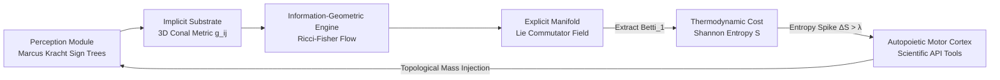

# 🌌 Aetherius Engine: Pure Mathematical Conal Architecture (PMCA) v6.0

[](AETHERIUS_POSITION_PAPER.pdf)
[](https://doi.org/10.5281/zenodo.21896408)
[](https://orcid.org/0009-0002-5509-0448)
[](LICENSE)
[](https://www.python.org/downloads/)
[](https://github.com/google/jax)

> **"How can machines reason deterministically without falling victim to the epistemic hallucinations inherent in large language models?"**

**Author:** Jonathan Wayne Fleuren ([`j.fleuren@aetheriuscognitivesystems.com`](mailto:j.fleuren@aetheriuscognitivesystems.com))  
**ORCID:** [0009-0002-5509-0448](https://orcid.org/0009-0002-5509-0448) | **Zenodo DOI:** [10.5281/zenodo.21896408](https://doi.org/10.5281/zenodo.21896408)

The **Aetherius Engine** implements the **Pure Mathematical Conal Architecture (PMCA v6.0)**—a zero-parameter neuro-symbolic substrate that grounds cognition into a continuous non-Euclidean 3D metric space $\mathbf{g}(z, r, \theta)$. 

Unlike autoregressive transformer models that generate text statistically over static parameter weights, PMCA enforces reasoning through an **Information-Geometric Ricci Flow** ($\frac{\partial g_{ij}}{\partial\tau} = -2 R_{ij} + \alpha F_{ij}$) that dynamically evolves manifold topology under real-time data constraints.

---

## 📄 Position Paper & Proofs

The complete formal position paper, manuscript, and mathematical validation framework are available in this repository:

- 📄 **[AETHERIUS_POSITION_PAPER.pdf](./AETHERIUS_POSITION_PAPER.pdf)** *(Compiled single-column position paper)*
- 📝 **[AETHERIUS_POSITION_PAPER.tex](./AETHERIUS_POSITION_PAPER.tex)** *(LaTeX source code)*
- 🏛️ **[ARCHITECTURE.md](./ARCHITECTURE.md)** *(Detailed Architectural Specification)*

---

## ⚡ Core Architecture



1. **The Perception Module:** Transduces natural language into Marcus Kracht Categorial Sign Trees $S = (A, C, M)$.
2. **The Implicit Substrate:** Constructs a dynamic 3D conal cylindrical metric tensor field $\mathbf{g}(z, r, \theta)$.
3. **The Information-Geometric Flow Engine:** Smooths contradictions and logical impossibilities purely through metric geometry.
4. **The Thermodynamic Cost Module:** Spikes Shannon Entropy when presented with logical or mathematical paradoxes ($Betti_1 > 0$).
5. **The Autopoietic Motor Cortex:** Deterministically triggers external scientific API queries (AlphaFold, PubMed, Astropy) to fetch missing topological mass and collapse contradictions.

---

## 🔬 Mathematical Validation Framework

PMCA is backed by four formal mathematical and empirical guarantees:

- **Monotonic Energy Dissipation (Lyapunov Functional):**
  $$\mathcal{F}(g) = \int_{\mathcal{M}} (R + |\nabla f|^2) e^{-f} dV \implies \frac{d\mathcal{F}}{d\tau} \le 0$$
  *Proves the engine monotonically converges toward a stable geometric attractor without chaotic divergence.*

- **Positive-Definiteness & Volume Bound (DeTurck Projection):**
  $$\lambda_{\min}(\mathbf{g}(\tau)) \ge \epsilon > 0 \quad \forall \tau$$
  *Ensures coordinate space never collapses to zero volume or inverts dimensions.*

- **Bottleneck Distance Topological Stability:**
  $$d_B(\mathrm{Dgm}(g), \mathrm{Dgm}(g')) \le \|g - g'\|_\infty$$
  *Guarantees minor syntactic perturbations result in bounded, predictable shifts in persistent homology ($\beta_0, \beta_1, \beta_2$).*

- **The Paradox Stress Test:**
  *Demonstrates that cascaded subconal layering ($TUVWXYZ$) prevents computational overload during high-density self-referential paradox processing, keeping internal harmony $H > 0.75$.*

---

## 🛠️ Installation & Quickstart

```bash
# Clone the repository
git clone https://github.com/your-username/aetherius-engine.git
cd aetherius-engine

# Install dependencies
pip install -e .
```

### Running the Ricci-Fisher Flow Solver

```python
import jax.numpy as jnp
from aetherius.geometry import ConalMetric
from aetherius.flow import RicciFisherFlow

# Initialize 3D Conal Metric Tensor
metric = ConalMetric(z_max=10.0, r_initial=1.0)
g = metric.compute_tensor(z=2.5, r=1.0, theta=0.0)

# Execute Information-Geometric Flow Step
flow_engine = RicciFisherFlow(alpha=0.1, dt=0.01)
g_smoothed = flow_engine.step(g)

print("Smoothed Metric Tensor:\n", g_smoothed)
```

---

## 🧠 Built-In Agent Skill Tree

This repository includes 7 pre-built agent skills in `.agents/skills/`. When you open this project in Antigravity or any agentic AI system, the agent automatically inherits:

1. `symbolic-math-prover`: SymPy calculus & metric differential geometry solvers.
2. `theoretical-physics-engine`: General Relativity, Schwarzschild geodesics & FLRW cosmology.
3. `particle-physics-qft-prover`: QFT, Dirac gamma algebra & 11D Calabi-Yau compactifications.
4. `classical-and-quantum-information-theory`: Shannon entropy, KL divergence & Fisher Information.
5. `quantum-information-and-mechanics`: Density matrices, von Neumann entropy & quantum entanglement.
6. `jax-xla-cuda-optimization`: High-throughput XLA compilation & TPU/GPU memory profiling.
7. `software-architecture-and-design-patterns`: SOLID architecture & automated pytest suites.

---

## 📜 Citation

If you use PMCA or the Aetherius Engine in your research, please cite:

```bibtex
@article{fleuren2026aetherius,
  title={A Path Towards Geometric Machine Intelligence: The Pure Mathematical Conal Architecture (PMCA) v6.0},
  author={Fleuren, Jonathan Wayne},
  author_email={j.fleuren@aetheriuscognitivesystems.com},
  orcid={0009-0002-5509-0448},
  journal={Aetherius Cognitive Systems},
  year={2026},
  doi={10.5281/zenodo.21896408},
  url={https://doi.org/10.5281/zenodo.21896408}
}
```

## 📄 License
This project is licensed under the MIT License - see the [LICENSE](LICENSE) file for details.
